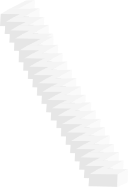

<html>
    <head>
        <meta charset="UTF-8" content="Hooooo饭制工具1.0,人人都能轻松的作出自己心仪的游戏!">
        <link rel="shortcut icon" href="tree3-height.svg">
    </head>
    <body oncontextmenu="yj();return false;">
        <title>
            Hooooo饭制工具
        </title>
        
        
        
        
        <button class="btn-nav" onClick="startMath=startMath+1;startMathP();start();">运行</button>
        <button class="btn-nav" onClick="by();">编译</button>
        <button class="btn-nav">对象</button>
        

            <h3>调试控制台</h3>
             
            运行次数:0 
            失误操作:0 
             
            
        

        
        <textarea id="wrrr" style="position:relative;top:999em;" cols="50" rows="10">
            
        </textarea>
        <a href="#"><button class="dx" style="position:relative;top:550em;">完成</button></a>
        

            <textarea style="color:brown;font-size:25px;background-color:white;width:30em;height:50em;border:none;" id="wrr">
        
            </textarea>
            

                <h3 style="color:red;">对象&#160;&#160;&#160;&#160;&#160;&#160;&#160;&#160;&#160;&#160;&#160;&#160;&#160;&#160;</h3>
                 
                 
                    
                    

                        关卡-绿色风暴-树1🎗️🎫
                    

                    <button class="dx" onClick="document.getElementById('wrr').value=document.getElementById('wrr').value+'game.math=3.2;\ncreatGameTree(x:,y:,size:,color:,t:);\n';">调用</button>

                    
                    

                        关卡-冬天-树1
                    

                    <button class="dx" onClick="document.getElementById('wrr').value=document.getElementById('wrr').value+'game.math=2.1;\ncreatGameTree(x:,y:,size:,color:,t:);\n';">调用</button>

                    
                    
                    

                        关卡-荒凉-树1
                    

                    <button class="dx" onClick="document.getElementById('wrr').value=document.getElementById('wrr').value+'game.math=1;\ncreatGameTree(x:,y:,size:,color:,t:);\n';">调用</button>

                    
                    

                        蜿蜒曲折的路--荒凉
                    

                    <button class="dx" onClick="document.getElementById('wrr').value=document.getElementById('wrr').value+'game.math=1;\n creatGameWay(src:,x:,y:,size:,t:);\n';">调用</button>

                    
                    

                        难度较大的路--冬天
                    

                    <button class="dx" onClick="document.getElementById('wrr').value=document.getElementById('wrr').value+'game.math=2.1;\n creatGameWay(src:,x:,y:,size:,t:);\n';">调用</button>
            

            
        

    </body>
</html>
